---
#### topics                   
1. SMPP               
2. SMPP & python intro        
3. current lay of the land                  
4. naz intro                                       
5. naz features                    
6. Q&A  

---
#### 1. intro                 
**Name:** Komu Wairagu   
**Occupation:** Software developer at [https://jumo.world/](https://jumo.world/)      

**About Me:** https://www.komu.engineer/about    
**Presentation:** https://gitpitch.com/komuw/naz/presentation

---
#### 1.1 SMPP
Short Message Peer-to-Peer.                     
It's a protocol designed for transfer of Short messages between an SMS server and a mobile phone.               
Based on exchange of request/response protocol data units(PDUs) between client & server over TCP/IP network.   
    

---
#### 1.2 Why care about SMPP? 
Typically used for SMS and USSD by Telcos(Mobile Network Operators).         
If you want to do integrate with various Telcos; you'll have to SMPP.      


---
#### 1.3 sequence of requests
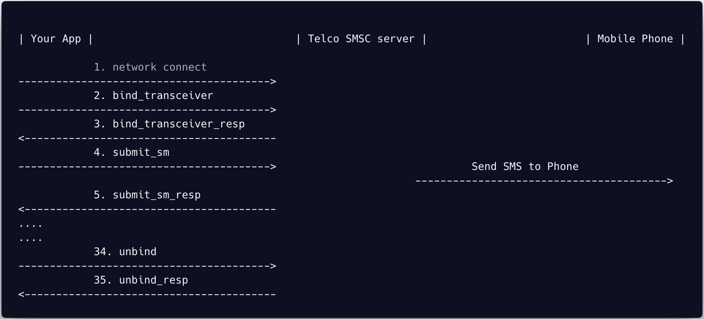                  


---
#### 1.4 PDU format
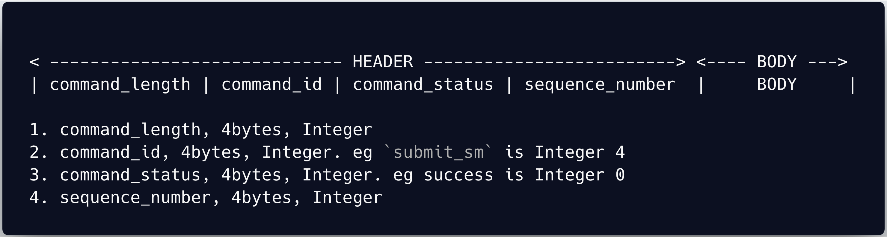            
           

---
#### 2. SMPP & python         
How do you connect to SMPP server(SMSC) from Python?


---
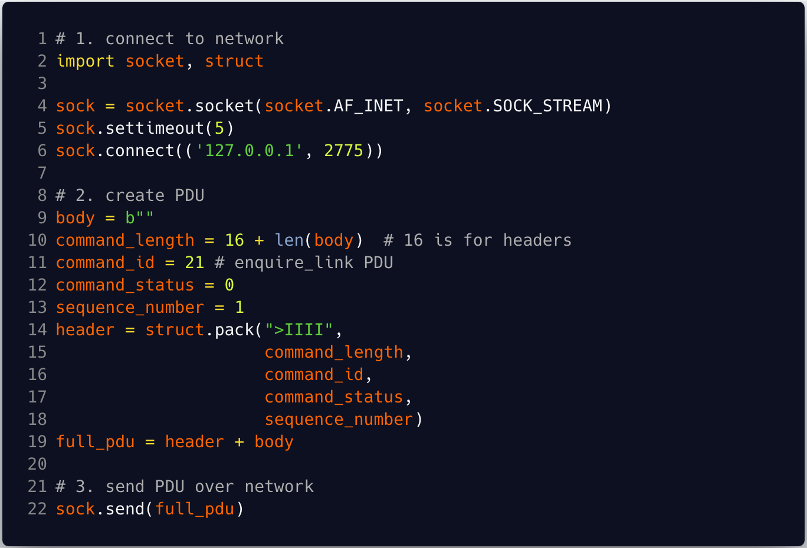            
   

---
#### 3. current lay of the land               
- github.com/podshumok/python-smpplib               
- github.com/praekelt/vumi                    
- ... couple more          

---
#### 3.1 problems with current solutions           
    - complexity of code base    
    - coupling with other things(rabbitMQ, redis, Twisted)      
    - non-granular configurability         
      - (you can only set `throttle_delay: X seconds` )
    - maintenance debt:
      - (we had to disable vumi sentry integration;   
         vumi outdated raven dependancies)
      - cant migrate your app to Python3(because vumi is py2)
    - lack of visibility(what is happenning?)      
      - (you have to enrich vumi logs). 


---
#### 4. naz intro                     
naz is an async SMPP client.       
It's easily configurable, BYO(throttlers, rateLimiters etc)        

---
#### 4.1 architecture                
| Your App |  ---> | Queue | ---> | Naz |                   
what is the Queue?? inMem, rabbitmq, redis ...??       
Naz makes no imposition of what the Queue is.      
BYO queue...             


---
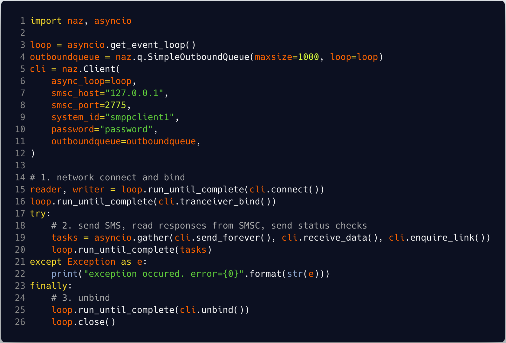    


---
#### 4.2.1 sequence of requests
                  


---
#### 5. naz features  
running theme: configurability, observability, BYO ... nini nini


---
#### 5.1.1 observability: logging  
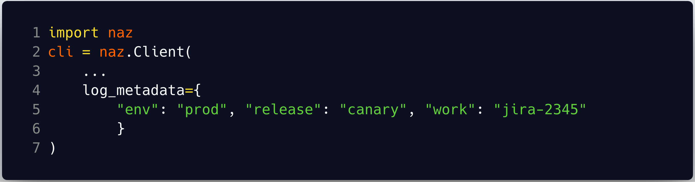                  

---
#### 5.1.1 observability: logs 
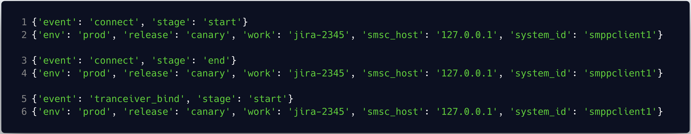                  


---
#### 5.1.2 observability: hooks          
An instance of a class that implements `naz.hooks.BaseHook`.  It has two methods `request` and `response`.         
create an instance implementation of `BaseHook`, plug it in, and u can do whatever u want inside `request`/`response` methods.  

---
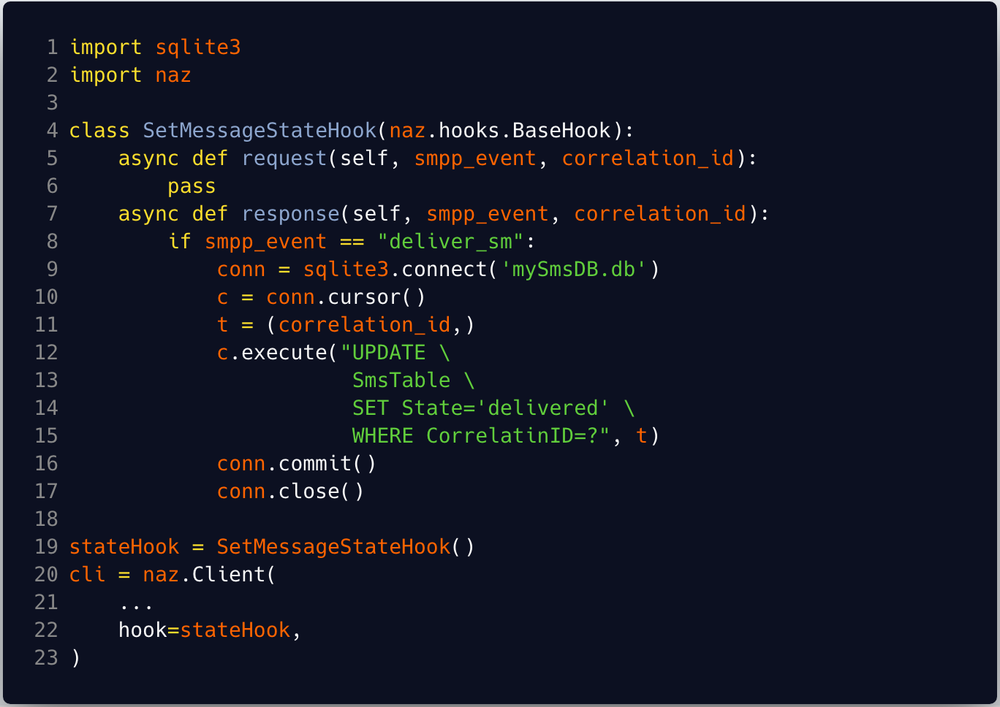


---
#### 5.1.2 observability: hooks example 2
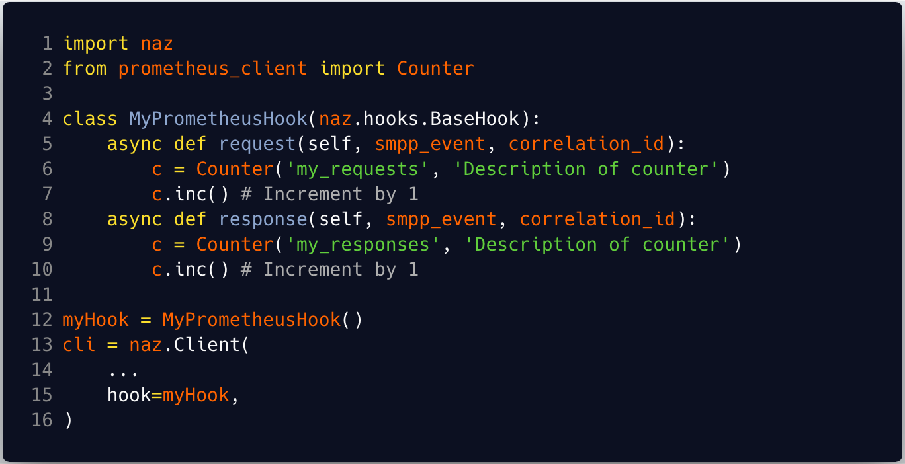


---
#### 5.2 Rate limiting  
An instance of a class that implements `naz.ratelimiter.BaseRateLimiter`.  It has one method `limit`.         
create an instance implementation of `BaseRateLimiter`, plug it in, and u can implement any rate limiting algo inside `limit` method.         
`naz` ships with a simple token-bucket Ratelimiter, `SimpleRateLimiter`   


---
#### 5.2 Rate limiting: example                
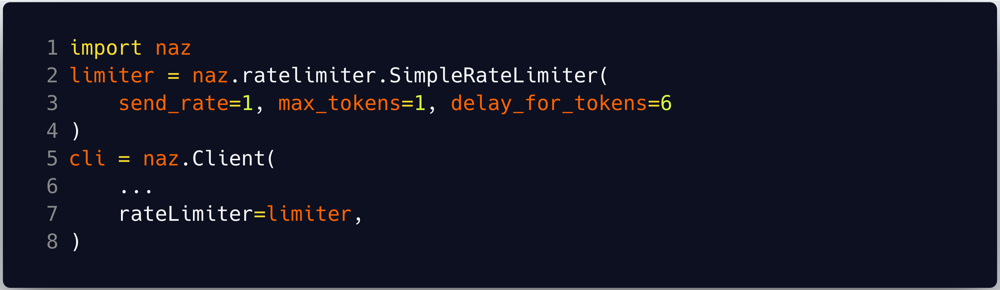


---
#### 5.2 Rate limiting - logs


---
#### 5.2 Rate limiting: example2                
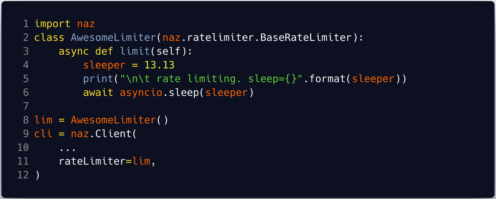


---
#### 5.4 Throttle handling     
An instance of a class that implements `naz.throttle.BaseThrottleHandler`.    
`naz` calls it to handle throttling events from Telco.            
`naz` ships with a default, `SimpleThrottleHandler`              

---
#### 5.4 Throttle handling; example
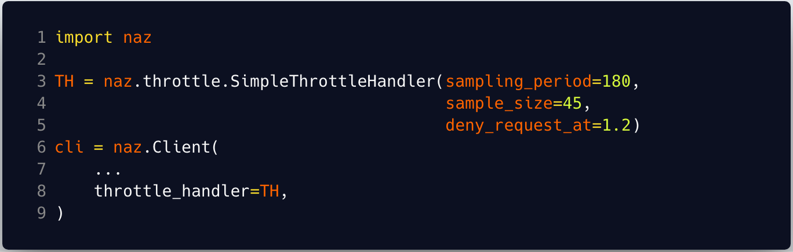


---
#### 5.5 Queuing               
An instance of a class that implements `naz.q.BaseOutboundQueue`. It has two methods `enqueue` & `dequeue`.         
what you put inside those two methods is upto you.         
Your app queues messages, naz consumes from that queue and then sends those messages to SMSC/server.           
`naz` ships with a `SimpleOutboundQueue` that queues in Memory.

---
#### 5.5 Queuing; example
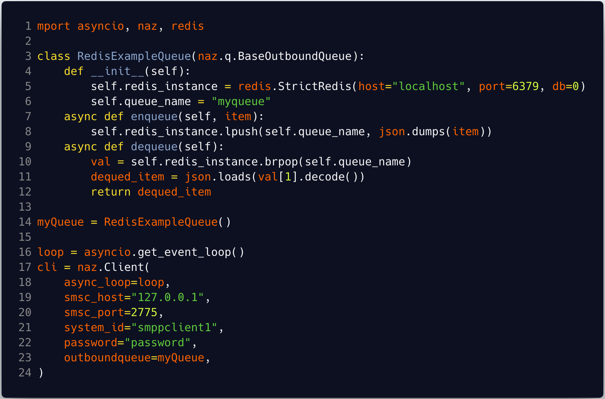


---
#### 5.5 Queuing; example (your app)
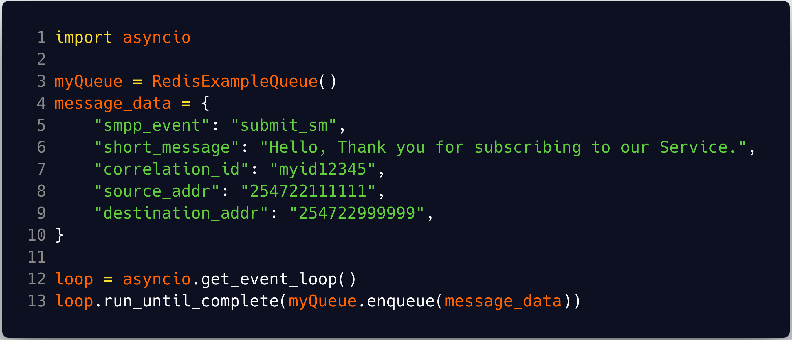

---
#### 5.6 cli app
this is installed when you install `naz`.       
```
naz-cli --help
```          
`naz-cli` consumes the `naz` api. 
It accepts a json config file.

---
#### 5.6 cli app; example
demo


---
#### 6. resources         
- https://github.com/komuw/naz                
- https://github.com/komuw/naz/blob/master/docs/SMPP_v3_4_specification.pdf   
- https://gitpitch.com/komuw/naz/presentation       
- https://github.com/praekelt/vumi          
      
- https://www.komu.engineer/about      


---
#### 6. Thanks
Q & A
