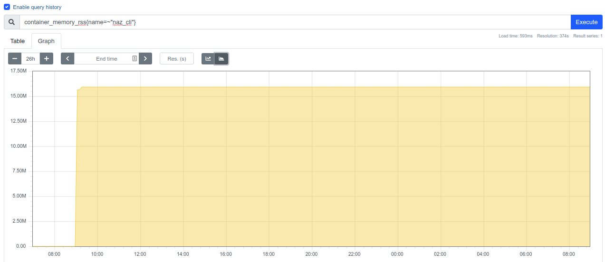

### Benchmarking naz
This benchmarks were ran using [naz version v0.6.1](https://github.com/komuw/naz/blob/master/CHANGELOG.md#version-v061)      
They were ran primarily to figure out;
- how fault tolerant `naz` is
- whether `naz` has any memory leaks.

### Methodology
The benchmark was run this way:

- `naz-cli` was deployed on a $5/month digitalocean server with 1GB of RAM and 1 cpu in the San Francisco region.       
- A mock SMSC server was deployed on a $5/month digitalocean server with 1GB of RAM and 1 cpu in the Amsterdam region.     
- A redis server was also deployed to the same $5/month digitalocean server in the Amsterdam region.   
- The ping latency between the `naz` server in Sanfrancisco and the SMSC server in Amsterdam was about `154 ms`    
- Approximately 100,000 messages were queued on the redis server.   
- `naz-cli` would consume the messages from the redis queue and send them out to the SMSC.   
- In a loop; the `SMSC` would run for a duration of between 13-16 minutes, stop for a duration of 1-3 minutes then continue etc.
- In a loop; the `redis server` would run for a duration of between 13-16 minutes, stop for a duration of 1-3 minutes then continue etc.
- All this while, `naz-cli` is accessing the redis server and SMSC; re-establishing connections when neccessary.
- All logs from `naz` were been sent to a timescaleDB container for later analysis.   
- Container/host and custom metrics were also been sent to a prometheus container for later analysis.  


### Results:
- `naz-cli` used a near constant amount of memory(19MB) throughout the whole benchmarking period. There was no indication of memory leaks.
   
- `naz-cli` was able to stay up during the whole period. This is despite the fact that the redis server and SMSC servers would 'go down' every 15minutes or so.     
   `naz-cli` was able to reconnect and re-bind whenever the SMSC came back up again
- During the running of these benchmarks, a number of bugs were identified in `naz`. Those bugs were fixed in [PR127](https://github.com/komuw/naz/pull/127). Eventually the benchmarks were re-ran with the fixed `naz` version.


#### misc.
connect:   
```sh
psql --host=localhost --port=5432 --username=myuser --dbname=mydb
```

```sql
SELECT * FROM logs ORDER BY timestamp DESC LIMIT 5;
```

Find errors:
```sql
SELECT * FROM logs WHERE length(logs.error) > 0 ORDER BY timestamp DESC;
```

```sql
SELECT event,log_id,error FROM logs WHERE length(logs.error) > 0 ORDER BY timestamp DESC;
Copy (SELECT * FROM logs WHERE length(logs.error) > 0 ORDER BY timestamp DESC) To '/tmp/errors.csv' With CSV DELIMITER ',';
cp /tmp/errors.csv /usr/src/app/
```
