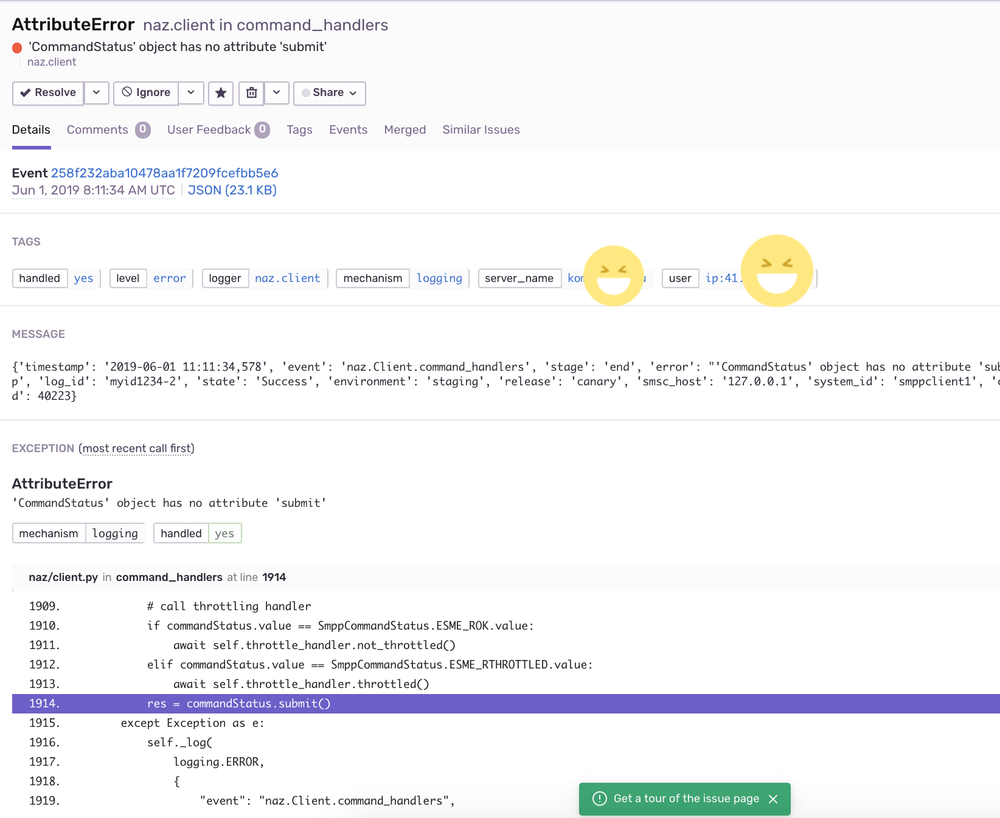

=====================
  Introduction to naz
=====================
naz is an async SMPP client.
It's name is derived from Kenyan hip hop artiste, Nazizi.

`SMPP is a protocol designed for the transfer of short message data between External Short Messaging Entities(ESMEs),   
Routing Entities(REs) and Short Message Service Center(SMSC).` - `Wikipedia <https://en.wikipedia.org/wiki/Short_Message_Peer-to-Peer>`_

| naz currently only supports SMPP version 3.4.
| naz has no third-party dependencies and it requires python version 3.6+

naz is in active development and it's API may change in backward incompatible ways.

**Table of Contents**

.. contents::
    :local:
    :depth: 1

1 Installation
=================
``pip install naz``

2 Usage
===============

2.1 As a library
==================

.. code-block:: python

    import asyncio
    import naz

    loop = asyncio.get_event_loop()
    outboundqueue = naz.q.SimpleOutboundQueue(maxsize=1000)
    cli = naz.Client(
        smsc_host="127.0.0.1",
        smsc_port=2775,
        system_id="smppclient1",
        password="password",
        outboundqueue=outboundqueue,
    )

    # queue messages to send
    for i in range(0, 4):
        print("submit_sm round:", i)
        loop.run_until_complete(
        cli.submit_sm(
            short_message="Hello World-{0}".format(str(i)),
            log_id="myid12345",
            source_addr="254722111111",
            destination_addr="254722999999",
        )
    )

    # connect to the SMSC host
    reader, writer = loop.run_until_complete(cli.connect())
    # bind to SMSC as a tranceiver
    loop.run_until_complete(cli.tranceiver_bind())

    try:
        # read any data from SMSC, send any queued messages to SMSC and continually check the state of the SMSC
        tasks = asyncio.gather(cli.dequeue_messages(), cli.receive_data(), cli.enquire_link())
        loop.run_until_complete(tasks)
        loop.run_forever()
    except Exception as e:
        print("exception occured. error={0}".format(str(e)))
    finally:
        loop.run_until_complete(cli.unbind())
        loop.stop()

NB:

* (a) For more information about all the parameters that `naz.Client` can take, consult the `docs <https://github.com/komuw/naz/blob/master/documentation/config.md>`_
* (b) More examples can be `found here <https://github.com/komuw/naz/tree/master/examples>`_ 
* (c) if you need an SMSC server/gateway to test with, you can use the `docker-compose <https://github.com/komuw/naz/blob/master/docker-compose.yml>`_ file in the ``naz`` repo to bring up an SMSC simulator.
      That docker-compose file also has a redis and rabbitMQ container if you would like to use those as your `naz.q.BaseOutboundQueue`.

2.2 As a cli app
=====================
``naz`` also ships with a commandline interface app called ``naz-cli`` (it is also installed by default when you `pip install naz`).

create a python config file, eg; `/tmp/my_app.py`

.. code-block:: python

    import naz
    from myfile import ExampleQueue

    client = naz.Client(
        smsc_host="127.0.0.1",
        smsc_port=2775,
        system_id="smppclient1",
        password="password",
        outboundqueue=ExampleQueue()
    )

and a python file, `myfile.py` (in the current working directory) with the contents:

.. code-block:: python

    import asyncio
    import naz
    class ExampleQueue(naz.q.BaseOutboundQueue):
        def __init__(self):
            loop = asyncio.get_event_loop()
            self.queue = asyncio.Queue(maxsize=1000, loop=loop)
        async def enqueue(self, item):
            self.queue.put_nowait(item)
        async def dequeue(self):
            return await self.queue.get()

then run:
``naz-cli --client tmp.my_app.client``

NB:

* (a) For more information about the naz config file, consult the `documentation <https://github.com/komuw/naz/blob/master/documentation/config.md>`_
* (b) More examples can be found; `examples <https://github.com/komuw/naz/tree/master/examples>`_ 
      As an example, start the SMSC simulator(``docker-compose up``) then in another terminal run, 
      ``naz-cli --client examples.example_config.client``

3 Features
=====================

3.1 async everywhere
=====================
| SMPP is an async protocol; the client can send a request and only get a response from SMSC/server 20mins later out of band.
| It thus makes sense to write your SMPP client in an async manner. We leverage python3's async/await to do so.

.. code-block:: python

    import naz
    import asyncio
    loop = asyncio.get_event_loop()
    outboundqueue = naz.q.SimpleOutboundQueue(maxsize=1000)
    cli = naz.Client(
        smsc_host="127.0.0.1",
        smsc_port=2775,
        system_id="smppclient1",
        password="password",
        outboundqueue=outboundqueue,
    )

3.2 monitoring and observability
==========================================

3.2.1 logging
=====================
| In ``naz`` you have the ability to annotate all the log events that naz will generate with anything you want.
| So, for example if you wanted to annotate all log-events with a release version and your app's running environment.

.. code-block:: python

    import naz
    cli = naz.Client(
        ...
        log_metadata={ "environment": "production", "release": "canary"},
    )

| and then these will show up in all log events.
| by default, naz annotates all log events with smsc_host, system_id and client_id

| ``naz`` also gives you the ability to supply your own logger. All you have to do is satisfy the `naz.log.BaseLogger <https://komuw.github.io/naz/logger.html#naz.log.BaseLogger>`_ interface
| For example if you wanted ``naz`` to use key=value style of logging, then just create a logger that does just that:

.. code-block:: python

    import naz

    class KVlogger(naz.log.BaseLogger):
        def __init__(self):
            self.logger = logging.getLogger("myKVlogger")
            handler = logging.StreamHandler()
            formatter = logging.Formatter("%(message)s")
            handler.setFormatter(formatter)
            if not self.logger.handlers:
                self.logger.addHandler(handler)
            self.logger.setLevel("DEBUG")
        def bind(self, loglevel, log_metadata):
            pass
        def log(self, level, log_data):
            # implementation of key=value log renderer
            message = ", ".join("{0}={1}".format(k, v) for k, v in log_data.items())
            self.logger.log(level, message)

    kvLog = KVlogger()
    cli = naz.Client(
        ...
        logger=kvLog,
    )

3.2.2 hooks
=====================
| A hook is a class with two methods `to_smsc` and `from_smsc`, ie it implements naz's `naz.hooks.BaseHook <https://komuw.github.io/naz/hooks.html#naz.hooks.BaseHook>`_ interface
| ``naz`` will call the `to_smsc` method just before sending data to SMSC and also call the `from_smsc` method just after getting data from SMSC.
| The default hook that naz uses is ``naz.hooks.SimpleHook`` which just logs the request and response.
| If you wanted, for example to keep metrics of all requests and responses to SMSC in your prometheus setup;

.. code-block:: python

    import naz
    from prometheus_client import Counter

    class MyPrometheusHook(naz.hooks.BaseHook):
        async def to_smsc(self, smpp_command, log_id, hook_metadata, pdu):
            c = Counter('my_requests', 'Description of counter')
            c.inc() # Increment by 1
        async def from_smsc(self,
                        smpp_command,
                        log_id,
                        hook_metadata,
                        status,
                        pdu):
            c = Counter('my_responses', 'Description of counter')
            c.inc() # Increment by 1

    myHook = MyPrometheusHook()
    cli = naz.Client(
        ...
        hook=myHook,
    )

another example is if you want to update a database record whenever you get a delivery notification event;

.. code-block:: python

    import sqlite3
    import naz

    class SetMessageStateHook(naz.hooks.BaseHook):
        async def to_smsc(self, smpp_command, log_id, hook_metadata, pdu):
            pass
        async def from_smsc(self,
                        smpp_command,
                        log_id,
                        hook_metadata,
                        status,
                        pdu):
            if smpp_command == naz.SmppCommand.DELIVER_SM:
                conn = sqlite3.connect('mySmsDB.db')
                c = conn.cursor()
                t = (log_id,)
                # watch out for SQL injections!!
                c.execute("UPDATE SmsTable SET State='delivered' WHERE CorrelatinID=?", t)
                conn.commit()
                conn.close()

    stateHook = SetMessageStateHook()
    cli = naz.Client(
        ...
        hook=stateHook,
    )

3.2.3 integration with bug trackers
======================================
| If you want to integrate `naz` with your bug/issue tracker of choice, all you have to do is use their logging integrator.   
| As an example, to integrate ``naz`` with `sentry <https://sentry.io/>`_, all you have to do is import and init the sentry sdk. A good place to do that would be in the naz config file, ie;

``/tmp/my_config.py``

.. code-block:: python

    import naz
    from myfile import ExampleQueue

    import sentry_sdk # import sentry SDK
    sentry_sdk.init("https://<YOUR_SENTRY_PUBLIC_KEY>@sentry.io/<YOUR_SENTRY_PROJECT_ID>")

    my_naz_client = naz.Client(
        smsc_host="127.0.0.1",
        smsc_port=2775,
        system_id="smppclient1",
        password="password",
        outboundqueue=ExampleQueue()
    )

| then run the `naz-cli` as usual:                
| ``naz-cli --client tmp.my_config.my_naz_client``    
| And just like that you are good to go. This is what errors from `naz` will look like on sentry(sans the emojis, ofcourse):

3.3 Rate limiting
=====================
| Sometimes you want to control the rate at which the client sends requests to an SMSC/server. ``naz`` lets you do this, by allowing you to specify a custom rate limiter.
| By default, naz uses a simple token bucket rate limiting algorithm implemented in ``naz.ratelimiter.SimpleRateLimiter``   

| You can customize naz's ratelimiter or even write your own ratelimiter (if you decide to write your own, you just have to satisfy the `naz.ratelimiter.BaseRateLimiter <https://komuw.github.io/naz/ratelimiter.html#naz.ratelimiter.BaseRateLimiter>`_ interface)

| To customize the default ratelimiter, for example to send at a rate of 35 requests per second.

.. code-block:: python

    import naz

    myLimiter = naz.ratelimiter.SimpleRateLimiter(send_rate=35)
    cli = naz.Client(
        ...
        rateLimiter=myLimiter,
    )

3.4 Throttle handling
=====================
| Sometimes, when a client sends requests to an SMSC/server, the SMSC may reply with an ESME_RTHROTTLED status.
| This can happen, say if the client has surpassed the rate at which it is supposed to send requests at, or the SMSC is under load or for whatever reason ¯_(ツ)_/¯

The way naz handles throtlling is via Throttle handlers.
A throttle handler is a class that implements the `naz.throttle.BaseThrottleHandler <https://komuw.github.io/naz/throttle.html#naz.throttle.BaseThrottleHandler>`_ interface

By default naz uses ``naz.throttle.SimpleThrottleHandler`` to handle throttling.
As an example if you want to deny outgoing requests if the percentage of throttles is above 1.2% over a period of 180 seconds and the total number of responses from SMSC is greater than 45, then;

.. code-block:: python

    from naz.throttle import SimpleThrottleHandler
    throttler = SimpleThrottleHandler(sampling_period=180,
                                    sample_size=45,
                                    deny_request_at=1.2)
    cli = naz.Client(
        ...
        throttle_handler=throttler,
    )

3.5 Queuing
=====================
`How does your application and naz talk with each other?`

It's via a queuing interface. Your application queues messages to a queue, ``naz`` consumes from that queue and then naz sends those messages to SMSC/server.

You can implement the queuing mechanism any way you like, so long as it satisfies the `naz.q.BaseOutboundQueue <https://komuw.github.io/naz/queue.html#naz.q.BaseOutboundQueue>`_ interface

| Your application should call that class's enqueue method to enqueue messages.
| Your application should enqueue a dictionary/json object with any parameters but the following are mandatory:

.. code-block:: bash

    {
        "version": "1",
        "smpp_command": naz.SmppCommand.SUBMIT_SM,
        "short_message": string,
        "log_id": string,
        "source_addr": string,
        "destination_addr": string
    }

For more information about all the parameters that are needed in the enqueued json object, `consult the documentation <https://github.com/komuw/naz/blob/master/documentation/config.md#2-naz-enqueued-message-protocol>`_ 

| naz ships with a simple queue implementation called ``naz.q.SimpleOutboundQueue``
| **NB:** ``naz.q.SimpleOutboundQueue`` should only be used for demo/test purposes.

An example of using that queue;

.. code-block:: python

    import asyncio
    import naz

    loop = asyncio.get_event_loop()
    my_queue = naz.q.SimpleOutboundQueue(maxsize=1000) # can hold upto 1000 items
    cli = naz.Client(
        ...
        outboundqueue=my_queue,
    )
    # connect to the SMSC host
    loop.run_until_complete(cli.connect())
    # bind to SMSC as a tranceiver
    loop.run_until_complete(cli.tranceiver_bind())

    try:
        # read any data from SMSC, send any queued messages to SMSC and continually check the state of the SMSC
        tasks = asyncio.gather(cli.dequeue_messages(), cli.receive_data(), cli.enquire_link())
        loop.run_until_complete(tasks)
        loop.run_forever()
    except Exception as e:
        print("exception occured. error={0}".format(str(e)))
    finally:
        loop.run_until_complete(cli.unbind())
        loop.stop()
    then in your application, queue items to the queue;

    # queue messages to send
    for i in range(0, 4):
        loop.run_until_complete(
        cli.submit_sm(
            short_message="Hello World-{0}".format(str(i)),
            log_id="myid12345",
            source_addr="254722111111",
            destination_addr="254722999999",
        )
    )

then in your application, queue items to the queue;

.. code-block:: python

    # queue messages to send
    for i in range(0, 4):
        loop.run_until_complete(
        cli.submit_sm(
            short_message="Hello World-{0}".format(str(i)),
            log_id="myid12345",
            source_addr="254722111111",
            destination_addr="254722999999",
        )
    )

4 Benchmarks
===============
Benchmarks can be found; `benchmarks <https://github.com/komuw/naz/blob/master/benchmarks/README.md>`_ 
